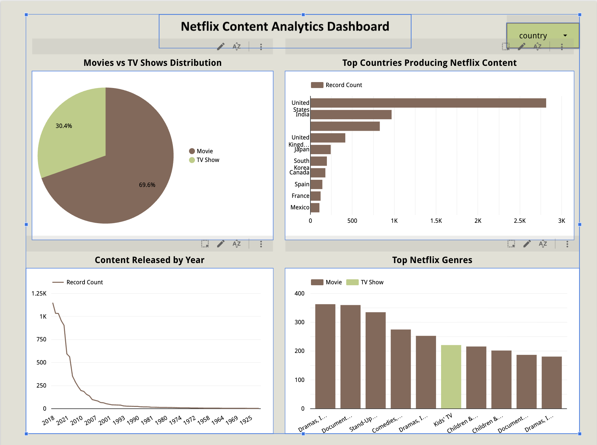

# Netflix Content Analytics Dashboard

## Overview
This project analyzes Netflix content trends using data visualization.

## Tools Used
- Google Sheets
- Looker Studio
- GitHub

## Insights
- Distribution of Movies vs TV Shows
- Top countries producing Netflix content
- Content release trends over time
- Genre distribution

## Dashboard Screenshot

